# Expense_Api_Flask
"Expense_api"  is a python web API (using Flask) which deals with basic operations of expenses.

## Prerequisites
Before you begin, ensure you have the following installed:

Docker [Docker Installation Guide](https://docs.docker.com/engine/install/)


Python 3.x [Python Installation Guide](https://www.python.org/downloads/)


## 1 -Running in Docker container

## 1.1 - Requirements File
Ensure you have a "requirements.txt" file in your application directory listing all Python dependencies needed for your Flask app.

## 1.2 - Building the Docker Image
From your application directory (where "Dockerfile" resides), run the following command to build your Docker image:

```bash 
docker build -t my-flask-app .
```
Replace 'my-flask-app' with your desired image name.

## 1.3 - Running the Docker Container
After successfully building the image, you can run your Flask API as a Docker container:

```bash
docker run -p 5000:5000 my-flask-app
```

This command maps port 5000 of the Docker container to port 5000 on your host machine, allowing you to access the Flask API at 'http://localhost:5000'.

## 1.4 - API Endpoints
Following are the API endpoints and their usage:

GET /api/:                             
Retrieves all records from Google sheet

GET /api/category/<string:value>:      
Retrieves all records by <category> from Google sheet

GET /api/summarybycategory:            
Shows summary (count,Total,average) by category

GET /api/paymentmode/<string:value>:   
Retrieves all records by <paymentmode> from Google sheet

GET /api/summarybypaymode:             
Shows summary (count,Total) by payment mode

GET /api/expensesbydaterange:          
Shows expenses by date range (start_date,end_date) as query parameters. start_date,end_date should be in (dd/mm/yyyy)

POST /api/add endpoint:                
To add new expense. The input will be in JSON.

PUT /api/update/<string:expense_id>:   
To update expense by <expense_id>

DELETE /api/delete/<string:expense_id>: 
To delete expense by <expense_id>

##  1.5 - With Example

Following is a sample googlesheet. It is also available on Github.

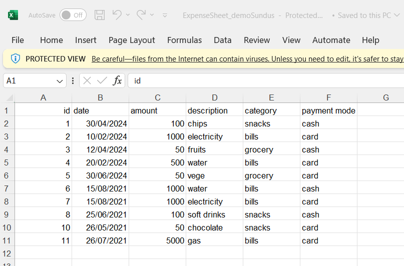

GET /api/: Retrieves all records from Google sheet

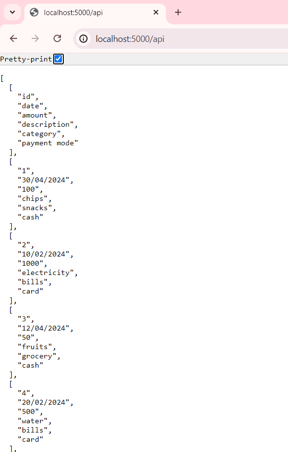 


GET /api/category/<string:value>: Retrieves all records by <category> from Google sheet

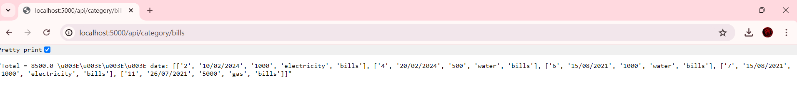


GET /api/summarybycategory: Shows summary (count,Total,average) by category

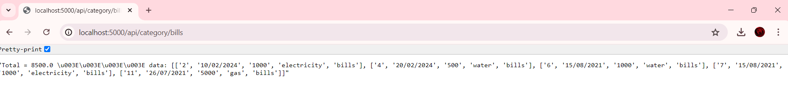

GET /api/paymentmode/<string:value>: Retrieves all records by <paymentmode> from Google sheet

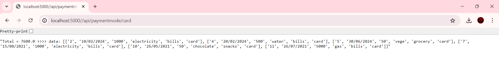

GET /api/summarybypaymode: Shows summary (count,Total) by payment mode

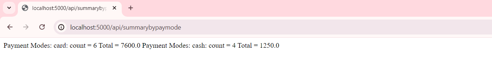

GET /api/expensesbydaterange: Shows expenses by date range (start_date,end_date) as query parameters. start_date,end_date should be in (dd/mm/yyyy)

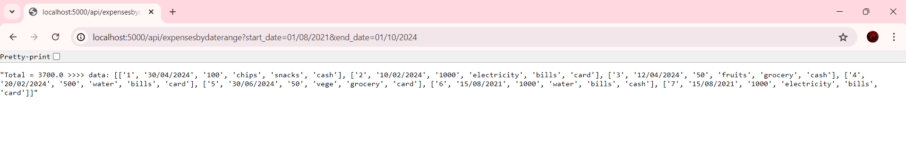


POST /api/add endpoint: To add new expense. The input will be in JSON. Following is the example:

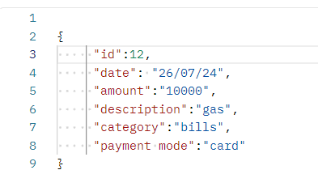

The following response will be generated on successful POST.

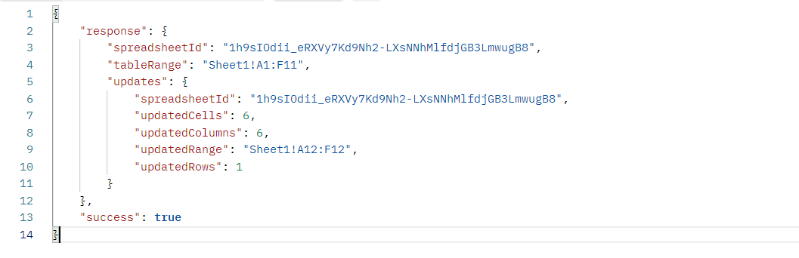


PUT /api/update/<string:expense_id>: To update expense by <expense_id>. Following is example updating expense_id=12. (which we have added above through POST). Updating its bill 'amount' to 5000.

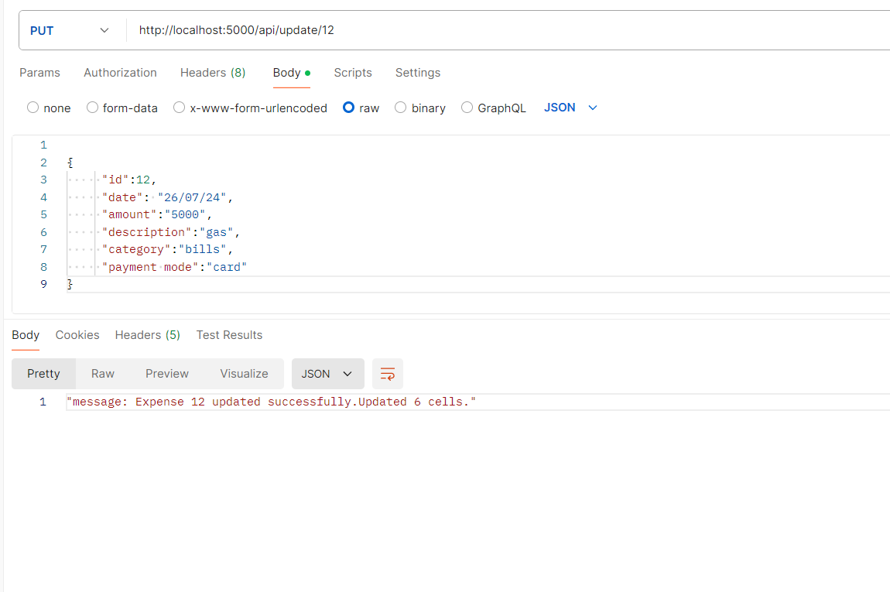

DELETE /api/delete/<string:expense_id>: To delete expense by <expense_id>. Following is example deleting expense_id=12. (which we have added above through POST and updated through PUT).

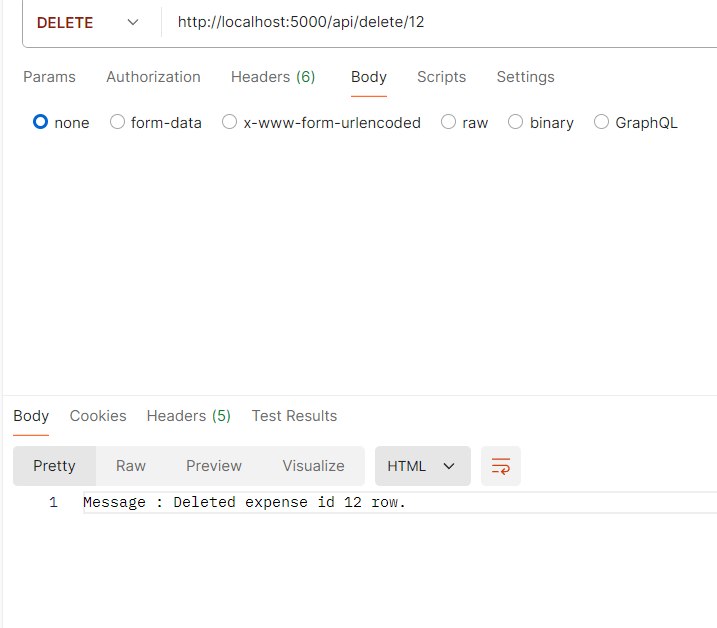


## 2 - Run Locally on Pycharm
## Libraries
Following are the main libraries used. And it can be installed in "pycharm" or "vsCode" by using code below. 

```bash
pip install pandas
pip install flask
pip install flask-restful
pip install gspread
pip install google-auth
pip install google-api-python-client
pip install datetime
```


